# Here-Cairo-Hackathon: Roundabout Detection from GeoSpatial Probe Data

This project aims to detect roundabouts from GeoSpatial Probe data using Four different approaches: Tabular Approach, Two Computer Vision approaches, and Pattern Recognition. The project leverages data cleaning, logistic regression, and computer vision techniques to identify circular patterns in movement, which are indicative of roundabouts.

## Project Overview

### 1. Tabular Approach

We applied a data-driven method to detect roundabouts using logistic regression and circular region detection:

- **Data Cleaning**: We excluded impossible speeds that occur during rotation, ensuring the data is reliable.
- **Mobility Tracing**: After removing noise from the data, we were able to trace mobility perfectly. This improvement in data quality made it significantly easier to detect whether a point was inside a circular region or not.

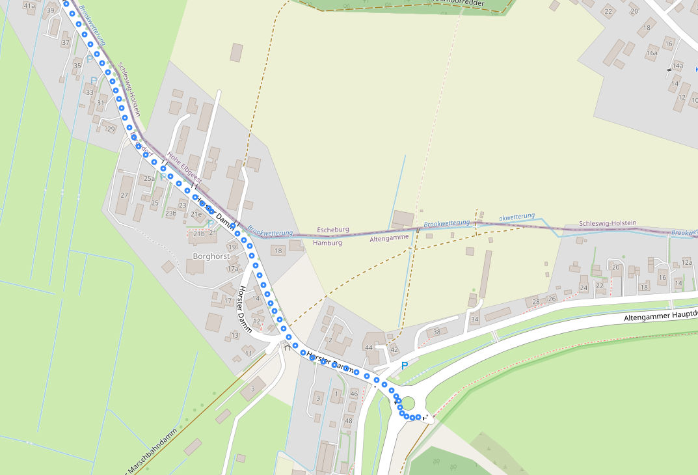

- **Logistic Regression**: This model was used to predict whether a data point falls within a roundabout area.
- **Circle Detection**:
  - Defined circular areas using their centers (latitude and longitude) and corresponding radii.
  - For each point, the distance to the center of each predefined circle was calculated. If the point was within the radius, it was considered inside the roundabout.
  
  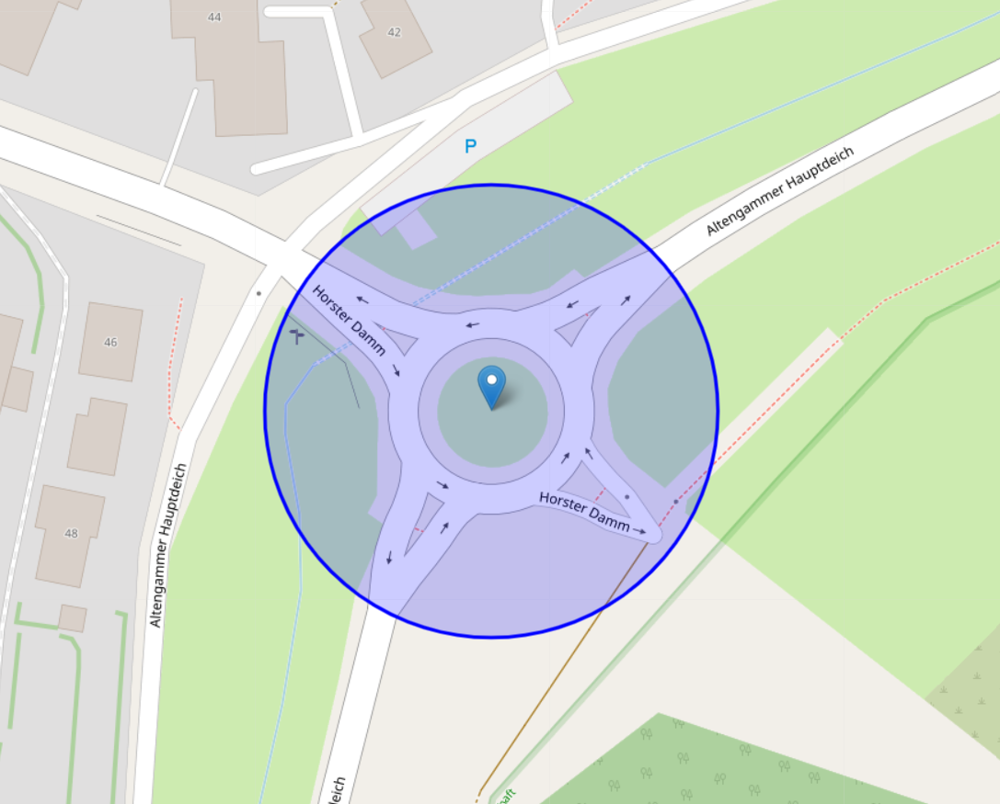
  
- **Headings Difference Calculation**:
  - The difference in headings between consecutive points was calculated.
  - These differences helped in identifying sharp turns, a key feature of circular movements, such as those seen in roundabouts.
  
  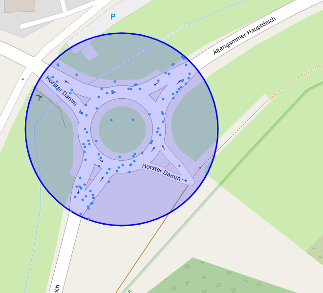

#### Tabular Approach Results

  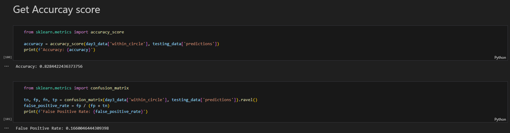

  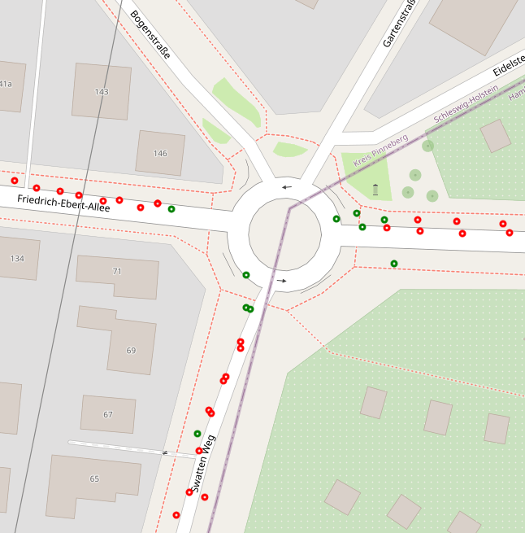

#### Tabular Approach Improvements (that can be done)

- **Features**:
  - Rotation
  - Steering angle
  - Wheel Base
- Neural networks, model selection, and fine-tuning
- Handling data as time-series
  - Using RNNs and LSTMs
- Detect user activity
- Generate accurate labels for roundabouts
- Determine what to do with yield signs, traffic lights, stop signs, road links, and navstreets
- Feedback model in case of U-turns

### 2. Computer Vision Approach 1

#### Image Capture
- Utilized Snazzy Maps and Google Maps styling to capture roundabouts.
- Applied specific color stylings to resemble heatmap data from probe sources.

#### Image Augmentation
- Used OpenCV for transformations, including rotation and flipping
- Randomly placed roundabouts at different sizes and positions on blank canvases

  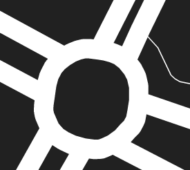

#### Data Preparation
- Created bounding boxes around roundabouts in the augmented images
- Prepared data for training the model on roundabout detection and classification

- **Model Selection**: Chose YOLOv8 Nano for its lightweight architecture and speed.

#### Training
- Utilized the prepared dataset of transformed and augmented roundabout images.
- Included diverse scenarios by varying size, rotation, and placement of roundabouts.
- Included other examples of road parts that are not roundabouts for training.

#### Prediction Examples
- Displaying model predictions on a subset of the dataset in the next slide
- Illustrates the model's ability to detect and classify roundabouts accurately

  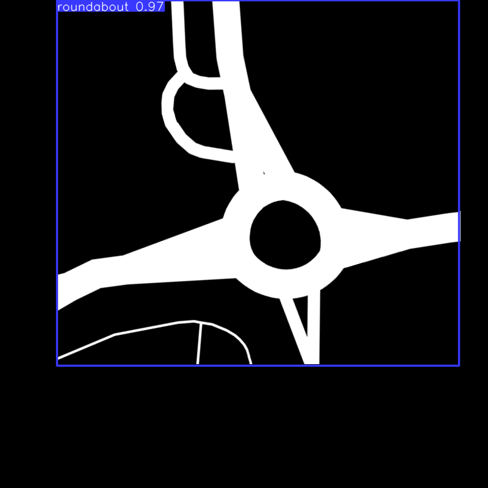

  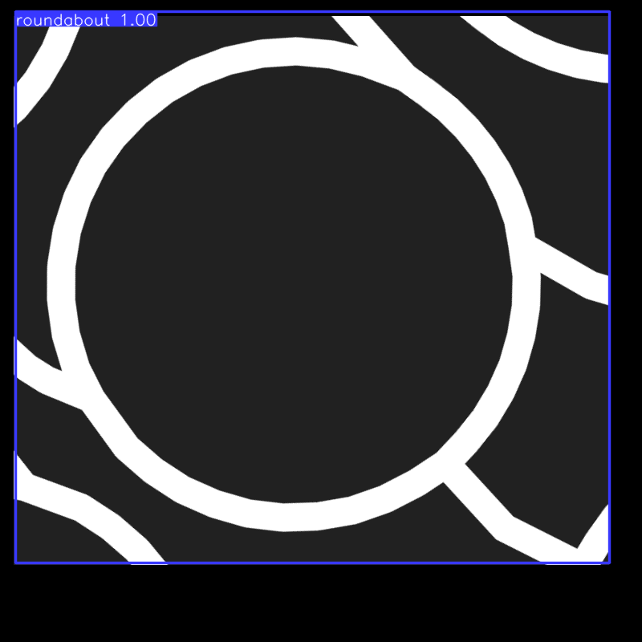

    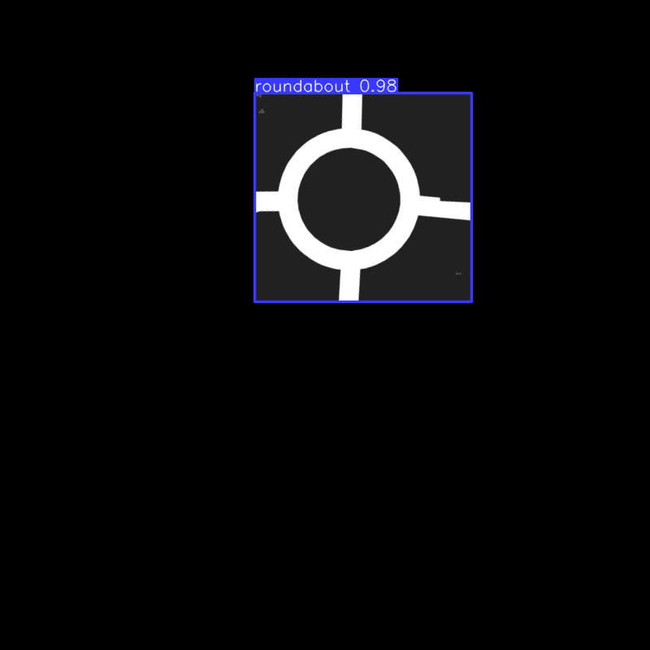

#### Key Results
- Fast inference suitable for real-time applications
- Demonstrated high accuracy on synthetic dataset

#### How Can We Improve

1. **Adding Noise to Data Connect Roads**
   - Integrate roundabout images with road networks.
   - This would require additional time for data labeling.

2. **Utilize Heatmap Images**
   - Integrate roundabout images with road networks.
   - This would require additional time for data labeling.

3. **Explore Models**
   - Using larger YOLOv8 models, such as YOLOv8-Large or higher.
   - Other YOLO versions like YOLOv10 as they made architectures with smaller/faster models but similar accuracy.
   - Or alternative frameworks like Meta's Detectron.
   - This is reasonable since extensive inference is not required.

### 3. Computer Vision Approach 2

1. Load each folder of data in its entirety and subdivide into smaller chunks based on longitude and latitude columns.
2. Apply a sliding window of size 2 to the chunks, focusing on specific regions of the map.
3. Aggregate chunks into a 500x500 grid, treating the dataset like an image.
4. Aggregate by counting the number of data points projected onto each pixel of the grid.
5. Remove outliers and apply Gaussian blur.
6. Apply logarithmic transformation twice to prevent skewing from large or unusual values.
7. Convert data into an image and apply computer vision techniques:
   - Binarize and invert the image
   - Perform contour detection
   - Sort detected contours based on circularity scores
   - Return contours representing circles

  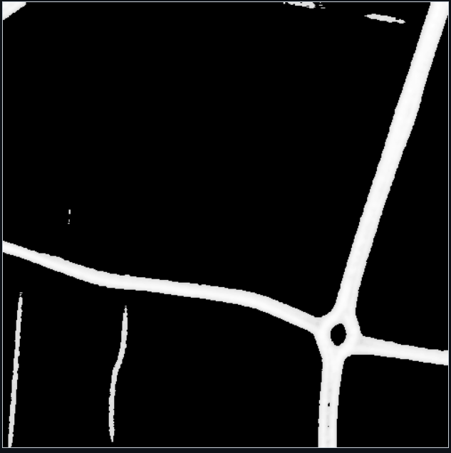

 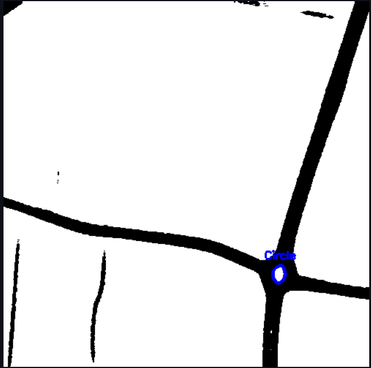

### 4. Pattern Recognition

Through simulation using generated data, we identified a pattern in the change of heading direction while approaching roundabouts. We observed similar patterns in the probe data and noticed that vehicles entering roundabouts typically do not exceed 120 km/h. After cleaning the data, we began to recognize consistent patterns in roundabout approaches.

 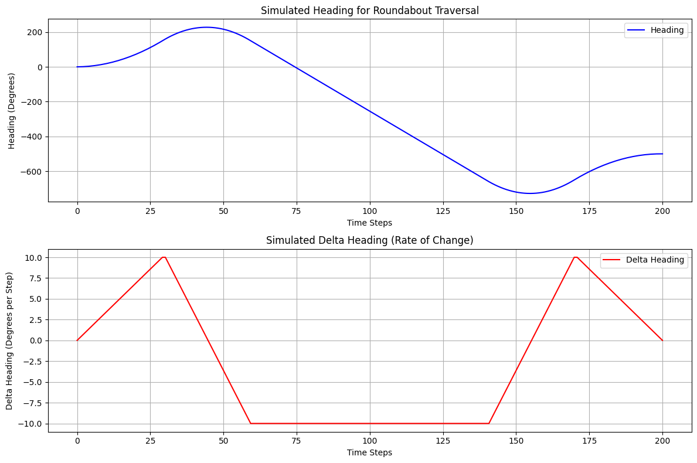

 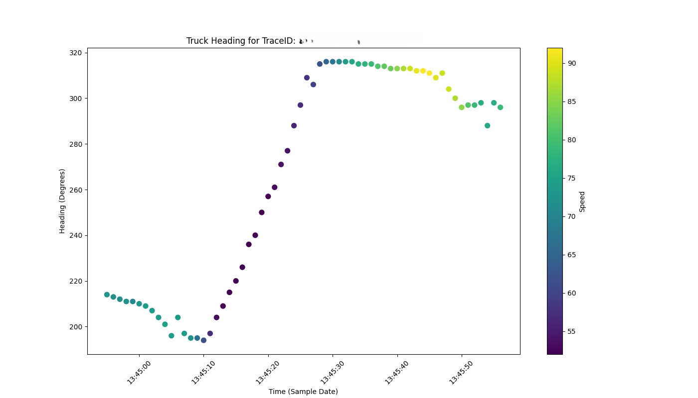
